

# 🌟 **ExpApprox - Exponential Calculator** 🌟  
### *Design & Implementation of an Exponential Function (e^t) Module*

---

## 🧭 **Tổng quan / Overview**

Dự án này thực hiện **một mô-đun phần cứng** tính toán giá trị xấp xỉ của hàm số mũ e^t bằng ngôn ngữ **VHDL**. Mô-đun (ExpApprox) nhận đầu vào là một số thực t và tính toán giá trị e^t tương ứng.

**Thành phần chính / Main components:**
- ⚙️ **Khối xử lý dữ liệu (Datapath)**: Thực hiện các phép toán chính như dịch bit, cộng/trừ và tra cứu bảng. Đi kèm là bảng tra cứu (LUT) lưu trữ các giá trị hằng số góc Hyperbolic atanh(2^-i).
- 🧠 **Khối điều khiển (Control Unit / FSMD)**: Quản lý luồng dữ liệu và các trạng thái tính toán dựa trên mô hình FSMD.
- 💾 **Bộ nhớ (Memory)**:  Chứa input tính toán đầu vào và output đầu ra, tác dụng như 1 buffer để CPU có thể gán nhiều phép tính cho Exponential.

Một **testbench** được cung cấp để mô phỏng và kiểm chứng độ chính xác của thuật toán trên phần mềm ModelSim và Vivado.

---

## 📘 **Thuật toán CORDIC Hyperbolic**
Hàm số mũ e^t được tính toán thông qua mối liên hệ với các hàm Hyperbolic Sine (sinh) và Hyperbolic Cosine (cosh):

                           e^t = cosh(t) + sinh(t)

**Nguyên lý thực hiện:**
- Thay thế phép nhân tốn kém bằng các phép **dịch bit** sang phải i lần.
- Sử dụng bảng tra cứu **Look-Up Table (LUT)** để lưu các giá trị atanh(2^-i).
- Sử dụng số học điểm cố định (**Fixed-point arithmetic**) định dạng Qm.n để biểu diễn số thực trên phần cứng.
---

## 🔌 **Tín hiệu Vào/Ra (I/O Ports)**

Khối ExpApprox có giao diện ghép nối với CPU để điều khiển quá trình tính toán.

| 🧩 Port | 🔁 Direction | 🔢 Width | 📝 Ý nghĩa (Meaning) |
| :--- | :---: | :---: | :--- |
| `Start` | In | 1 bit | Kích hoạt quá trình tính toán |
| `Clock` | In | 1 bit | Tín hiệu xung nhịp hệ thống  |
| `Reset` | In | 1 bit | Đặt lại hệ thống về trạng thái ban đầu  |
| `Done` | Out | 1 bit | Báo hiệu hoàn tất quá trình tính toán |

Hình 2: Giao diện ghép nối I/O giữa CPU và Memory

---

## 💻 **Thuật toán tham khảo**

Dưới đây là logic lặp của thuật toán CORDIC được thực hiện trong thiết kế:
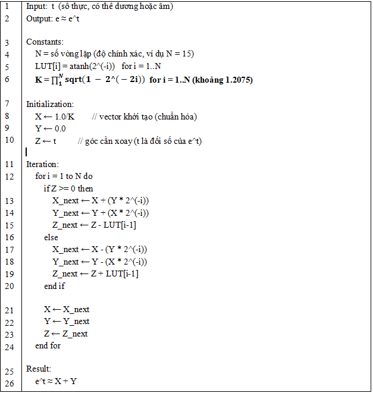

---

## 🧩 **Datapath & FSMD & FSM Minh họa**
💻 **Datapath**
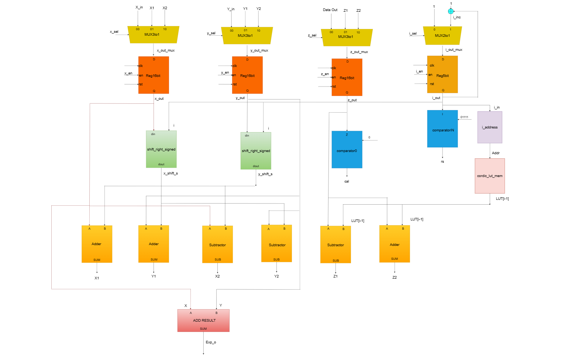
📘 **FSMD Diagram**  
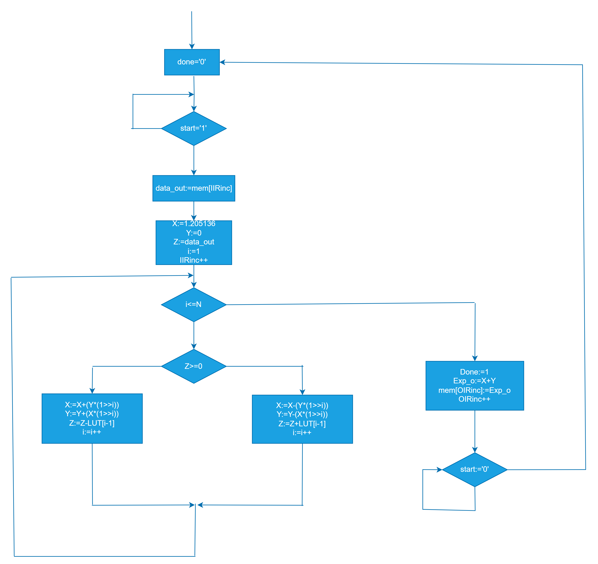

📗 **FSM Diagram**  
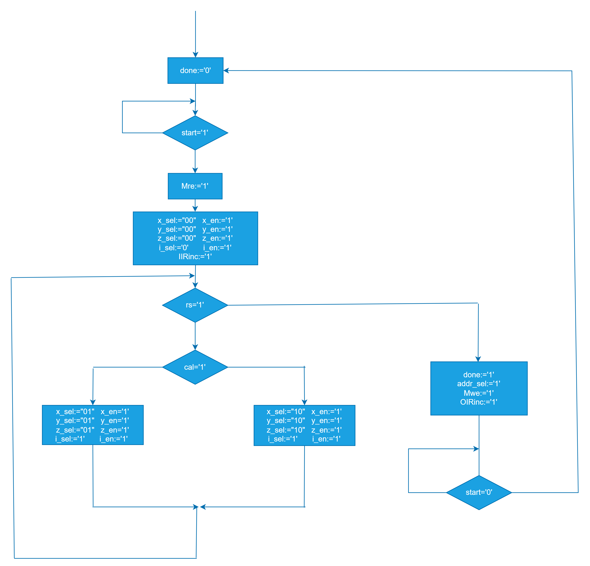

---

## 🧱 **Sơ đồ khối tổng thể / System Block Diagram**

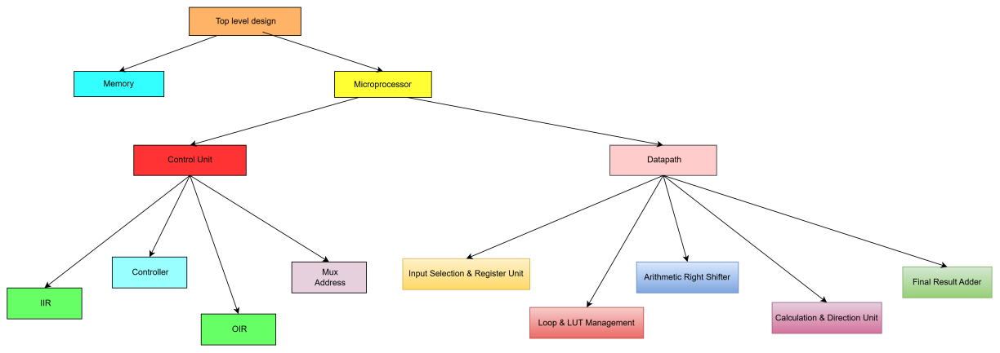
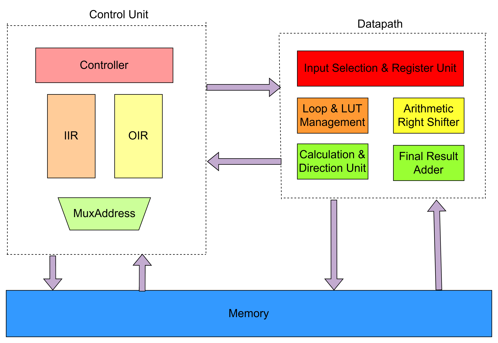

📈 **Toàn bộ hệ thống tính toán**  
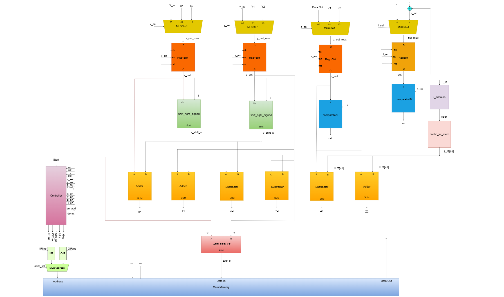

---

## 🧪 **Kết quả Mô phỏng (Simulation Results)**

📊 **Dạng sóng mô phỏng:**  
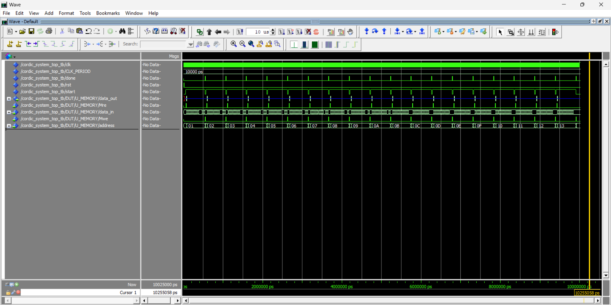
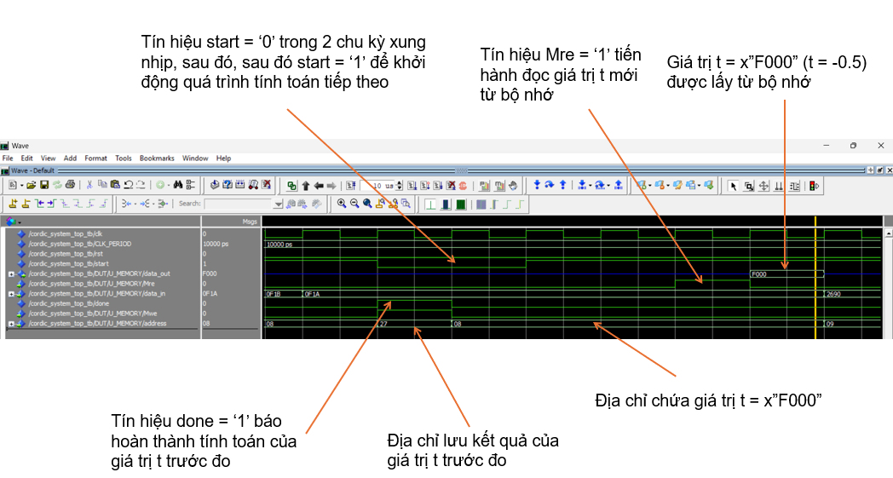
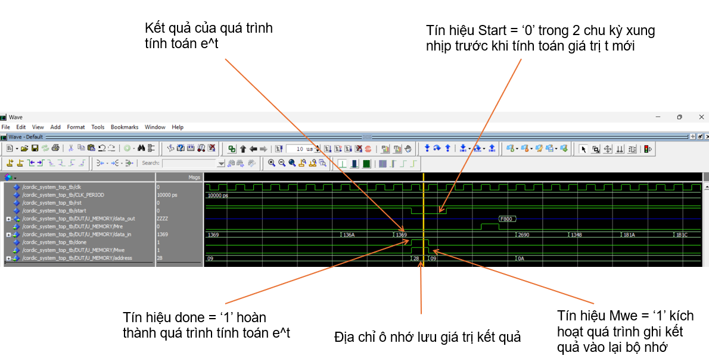
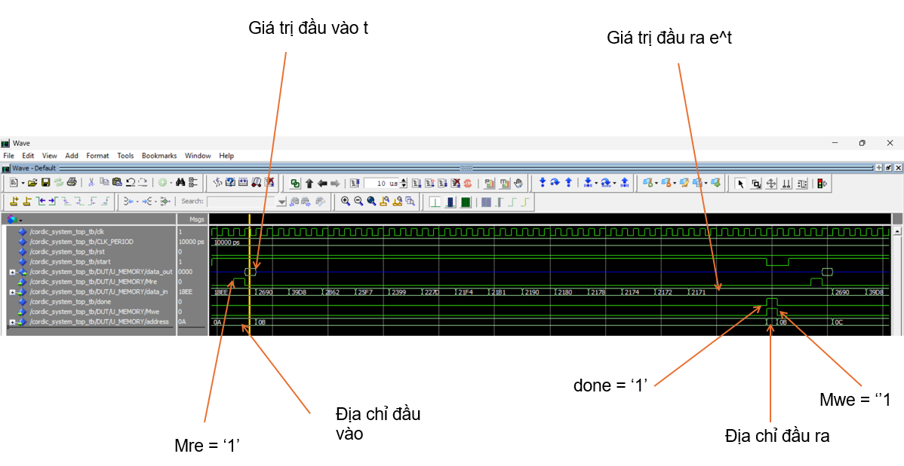
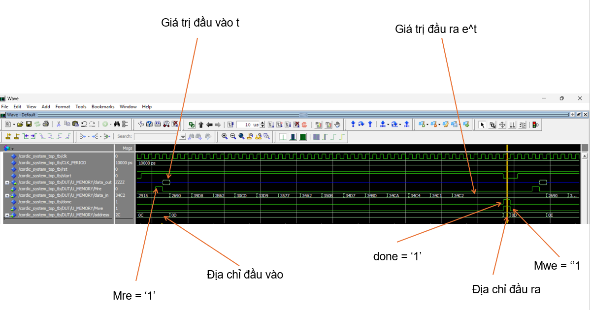
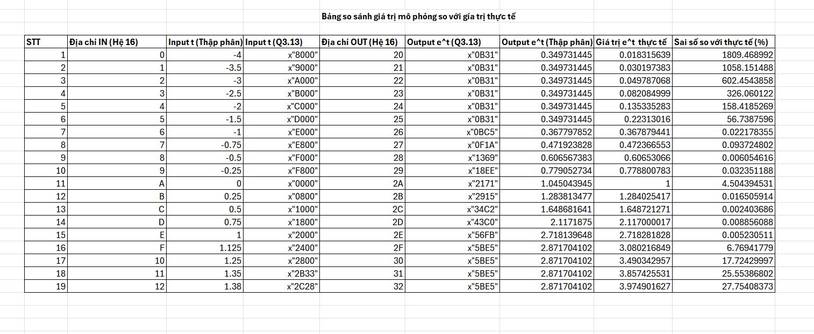
---

## ▶️ **Cách chạy mô phỏng (Simulation Steps)**

1️⃣ Mở dự án trong **ModelSim** hoặc **Vivado**.  
2️⃣ Biên dịch tất cả các file VHDL.  
3️⃣ Chạy mô phỏng với testbench.  
4️⃣ Quan sát các tín hiệu trong cửa sổ waveform.

---

## ✨ **Tác giả / Authors**

👨‍💻 **Đoàn Đức Mạnh** — [GitHub: JerryK4](https://github.com/JerryK4)  
👨‍💻 **Dương Trung Hiếu** — [GitHub: NoobKid04](https://github.com/NoobKid04)

---

📚 *Dự án được phát triển trong khuôn khổ môn học “Thiết kế mạch tích hợp số”*  
💡 *Design & Implementation of an Exponential Function (e^t) Module*

